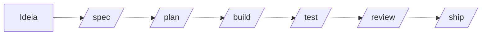

# Agent Skills para Copilot

Este repositório reúne fluxos de trabalho reutilizáveis, personas especializadas e checklists de apoio para o GitHub Copilot no VS Code. A organização e a filosofia foram inspiradas em [addyosmani/agent-skills](https://github.com/addyosmani/agent-skills).

> Observação: os arquivos operacionais dentro de [.github/](.github) permanecem em inglês para manter a compatibilidade com o Copilot e com outras ferramentas. Este README é a visão geral em português.

## O que existe aqui

- [.github/copilot-instructions.md](.github/copilot-instructions.md) - instruções sempre ativas para o GitHub Copilot
- [.github/AGENTS.md](.github/AGENTS.md) - arquivo de regras do workspace para outros agentes
- [.github/prompts/](.github/prompts) - comandos reutilizáveis como `/spec`, `/plan`, `/build`, `/test`, `/review` e `/ship`
- [.github/agents/](.github/agents) - personas especializadas como `code-reviewer`, `test-engineer` e `security-auditor`
- [.github/skills/](.github/skills) - detalhes operacionais de cada etapa do fluxo
- [.github/references/](.github/references) - checklists e notas de orquestração


## Fluxo usual

O fluxo padrão é este:



Em resumo:

- `/spec` transforma uma ideia vaga em uma especificação clara.
- `/plan` quebra a especificação em etapas executáveis.
- `/build` implementa em pequenas fatias.
- `/test` cria ou ajusta testes para provar o comportamento.
- `/review` avalia qualidade, segurança e performance.
- `/ship` faz a validação final antes de liberar.

## Exemplo prático

Se o objetivo for adicionar validação de e-mail no cadastro, um fluxo comum seria:

1. Rodar `/spec` para definir o comportamento esperado, os critérios de aceitação e as bordas do problema.
2. Rodar `/plan` para separar as tarefas em partes menores, por exemplo: validação, endpoint, testes e revisão.
3. Rodar `/build` para implementar a mudança em pequenos passos, sem perder o estado funcional.
4. Rodar `/test` para criar o teste de regressão e garantir que a validação realmente funciona.
5. Rodar `/review` para verificar se a mudança está correta, legível, segura e bem estruturada.
6. Rodar `/ship` para fazer a revisão final com `code-reviewer`, `security-auditor` e `test-engineer` quando fizer sentido.

Um exemplo de comando, do começo ao fim, pode ficar assim:

```text
/spec adicionar validação de e-mail no cadastro
/plan
/build
/test
/review
/ship
```

## Comandos e personas

| Comando | O que faz | Skill por trás |
|---|---|---|
| `/spec` | Cria uma especificação antes da implementação | `spec-driven-development` |
| `/plan` | Quebra a especificação em tarefas | `planning-and-task-breakdown` |
| `/build` | Implementa em pequenas fatias | `incremental-implementation` |
| `/test` | Guia a criação de testes primeiro | `test-driven-development` |
| `/review` | Faz a revisão de qualidade com a persona de revisão | `code-reviewer` + `code-review-and-quality` |
| `/code-review` | Aciona a persona de revisão diretamente | `code-reviewer` |
| `/test-engineer` | Aciona a persona de testes diretamente | `test-engineer` |
| `/security-audit` | Aciona a persona de segurança diretamente | `security-auditor` |
| `/ship` | Faz a checagem final em paralelo antes da entrega | `code-reviewer`, `security-auditor` e `test-engineer` |

As três personas principais são:

- `code-reviewer`
- `test-engineer`
- `security-auditor`

## Skills por fase

| Fase | Skills mais comuns |
|---|---|
| Definir | `idea-refine`, `spec-driven-development` |
| Planejar | `planning-and-task-breakdown` |
| Construir | `context-engineering`, `incremental-implementation`, `frontend-ui-engineering`, `api-and-interface-design` |
| Verificar | `test-driven-development`, `browser-testing-with-devtools`, `debugging-and-error-recovery` |
| Revisar | `code-review-and-quality`, `security-and-hardening`, `performance-optimization` |
| Entregar | `git-workflow-and-versioning`, `ci-cd-and-automation`, `documentation-and-adrs`, `shipping-and-launch` |

## Regras de orquestração

- O usuário ou um slash command orquestra o fluxo.
- Personas não chamam outras personas.
- Skills são etapas obrigatórias de trabalho, não referências opcionais.
- `/ship` é o único padrão nativo de fan-out paralelo neste repositório.

## Como pensar no uso diário

- Use `/spec` quando a ideia ainda estiver vaga ou incompleta.
- Use `/plan` quando você já souber o que quer construir, mas ainda não tiver uma sequência clara.
- Use `/build` quando o plano estiver aprovado e for hora de implementar.
- Use `/test` quando a mudança precisar de prova objetiva de comportamento.
- Use `/review` quando quiser checar qualidade antes de integrar.
- Use `/ship` quando a entrega já estiver pronta e precisar de uma validação final ampla.

## Inspiração

Este layout segue a mesma filosofia de organização do projeto [addyosmani/agent-skills](https://github.com/addyosmani/agent-skills): documentação enxuta, comandos previsíveis e divisão clara entre instruções, personas, skills e checklists.

Para mais detalhes, use os arquivos em [.github/skills/](.github/skills) e os checklists em [.github/references/](.github/references).
