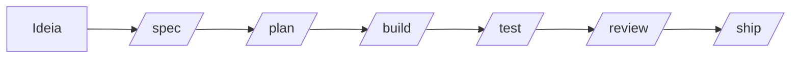

<a id="readme-top"></a>

<!-- ESCUDOS DO PROJETO -->

[![Contributors][contributors-shield]][contributors-url]
[![Forks][forks-shield]][forks-url]
[![Stargazers][stars-shield]][stars-url]
[![Issues][issues-shield]][issues-url]
[![Unlicense License][license-shield]][license-url]
[![LinkedIn][linkedin-shield]][linkedin-url]

<!-- LOGOTIPO DO PROJETO -->
<br />
<div align="center">
  <a href="https://github.com/alissonpef/copilot_agent_skills">
    
  </a>

  <h3 align="center">Copilot Agent Skills</h3>

  <p align="center">
    Fluxos de trabalho reutilizáveis, personas especializadas e checklists de apoio para o GitHub Copilot no VS Code.
    <br />
    <a href="https://github.com/alissonpef/copilot_agent_skills"><strong>Explore a documentação »</strong></a>
    <br />
    <br />
    <a href="https://github.com/alissonpef/copilot_agent_skills/issues/new?labels=bug&template=bug-report---.md">Reportar Bug</a>
    &middot;
    <a href="https://github.com/alissonpef/copilot_agent_skills/issues/new?labels=enhancement&template=feature-request---.md">Solicitar Recurso</a>
  </p>
</div>

<!-- ÍNDICE -->
<details>
  <summary>Índice</summary>
  <ol>
    <li>
      <a href="#sobre-o-projeto">Sobre O Projeto</a>
      <ul>
        <li><a href="#construído-com">Construído Com</a></li>
      </ul>
    </li>
    <li>
      <a href="#começando">Começando</a>
      <ul>
        <li><a href="#pré-requisitos">Pré-requisitos</a></li>
        <li><a href="#instalação">Instalação</a></li>
      </ul>
    </li>
    <li><a href="#uso">Uso</a></li>
    <li><a href="#contribuindo">Contribuindo</a></li>
    <li><a href="#licença">Licença</a></li>
    <li><a href="#contato">Contato</a></li>
  </ol>
</details>

<!-- SOBRE O PROJETO -->

## Sobre O Projeto

Este repositório reúne fluxos de trabalho reutilizáveis (skills), personas especializadas (agents) e checklists de apoio (references) para o GitHub Copilot no VS Code. A organização e a filosofia foram inspiradas no projeto `addyosmani/agent-skills`.

O objetivo principal é mitigar a imprevisibilidade de assistentes e agentes de IA durante o ciclo de desenvolvimento de software, garantindo consistência através de fases claras e repetíveis (como especificação, planejamento, implementação, testes e revisão).

Aqui está o porquê:
* Seu tempo deve ser focado em criar e resolver problemas reais, e não em guiar a IA manualmente a cada prompt.
* Processos repetitivos como pedir revisões de código, planejar tarefas ou criar especificações podem ser automatizados com comandos estruturados.
* O uso de personas e habilidades especializadas reduz o ruído de contexto e melhora a qualidade do código gerado pela IA.

<p align="right">(<a href="#readme-top">voltar ao topo</a>)</p>

### Construído Com

Esta seção lista os principais padrões, ferramentas e tecnologias usados no projeto.

* [![GitHub Copilot][Copilot-shield]][Copilot-url]
* [![Markdown][Markdown-shield]][Markdown-url]
* [![YAML][YAML-shield]][YAML-url]
* [![Mermaid][Mermaid-shield]][Mermaid-url]
* [![VS Code][VSCode-shield]][VSCode-url]
* [![Git][Git-shield]][Git-url]

<p align="right">(<a href="#readme-top">voltar ao topo</a>)</p>

<!-- COMEÇANDO -->

## Começando

Para utilizar estes fluxos e comandos em seu ambiente local, siga as instruções abaixo.

### Pré-requisitos

Para gerenciar o ambiente de desenvolvimento e executar utilitários de validação ou formatação das regras em Markdown, você precisará do gerenciador de pacotes `uv`.

* Instale o `uv` (se ainda não o tiver instalado):
  ```sh
  curl -LsSf https://astral.sh/uv/install.sh | sh
  ```

### Instalação

1. Clone o repositório em sua máquina:
   ```sh
   git clone https://github.com/alissonpef/copilot_agent_skills.git
   ```
2. Acesse a pasta do projeto:
   ```sh
   cd copilot_agent_skills
   ```
3. Sincronize o ambiente e instale as dependências de formatação (`mdformat`):
   ```sh
   uv sync
   ```

<p align="right">(<a href="#readme-top">voltar ao topo</a>)</p>

<!-- EXEMPLOS DE USO -->

## Uso

O fluxo padrão de desenvolvimento usando os comandos do Copilot consiste nas seguintes etapas:



### Comandos Principais

| Comando | Descrição | Skill Vinculada |
|---|---|---|
| `/spec` | Transforma ideias vagas em uma especificação concreta | `spec-driven-development` |
| `/plan` | Divide a especificação em tarefas menores e gerenciáveis | `planning-and-task-breakdown` |
| `/build` | Executa a implementação incremental em pequenas etapas | `incremental-implementation` |
| `/test` | Guia a criação de testes e validação comportamental | `test-driven-development` |
| `/review` | Avalia qualidade do código, performance e conformidade | `code-reviewer` + `code-review-and-quality` |
| `/ship` | Realiza a checagem final e validação ampla de pré-entrega | `shipping-and-launch` |

### Formatação de Arquivos Markdown

Para garantir que todos os arquivos `.md` sigam o padrão correto de estilo e formatação, você pode executar o `mdformat` através do `uv`:

```sh
# Validar e formatar arquivos da pasta .github/
uv run mdformat .github/
```

<p align="right">(<a href="#readme-top">voltar ao topo</a>)</p>

<!-- CONTRIBUINDO -->

## Contribuindo

As contribuições são o que tornam a comunidade open source um lugar tão incrível para aprender, inspirar e criar. Qualquer contribuição que você fizer será **muito apreciada**.

Se você tiver alguma sugestão que tornaria isso melhor, por favor faça o fork do repositório e crie um pull request. Você também pode simplesmente abrir uma issue com a tag "enhancement".
Não se esqueça de dar uma estrela ao projeto! Obrigado novamente!

1. Faça o Fork do Projeto
2. Crie a sua Branch de Funcionalidade (`git checkout -b feature/FuncionalidadeIncrivel`)
3. Commit suas Mudanças (`git commit -m 'Adicione alguma FuncionalidadeIncrivel'`)
4. Faça o Push para a Branch (`git push origin feature/FuncionalidadeIncrivel`)
5. Abra um Pull Request

### Principais contribuidores:

<a href="https://github.com/alissonpef/copilot_agent_skills/graphs/contributors">
  
</a>

<p align="right">(<a href="#readme-top">voltar ao topo</a>)</p>

<!-- LICENÇA -->

## Licença

Distribuído sob a Licença Unlicense. Veja `LICENSE` para mais informações.

<p align="right">(<a href="#readme-top">voltar ao topo</a>)</p>

<!-- CONTATO -->

## Contato

Alisson Pereira Ferreira - alissonpef@gmail.com - [LinkedIn](https://www.linkedin.com/in/alisson-pereira-ferreira/)

Link do Projeto: [https://github.com/alissonpef/copilot_agent_skills](https://github.com/alissonpef/copilot_agent_skills)

<p align="right">(<a href="#readme-top">voltar ao topo</a>)</p>

---

Made with ❤️ by **Alisson Pereira**.

<!-- MARKDOWN LINKS & IMAGES -->
[contributors-shield]: https://img.shields.io/github/contributors/alissonpef/copilot_agent_skills.svg?style=for-the-badge
[contributors-url]: https://github.com/alissonpef/copilot_agent_skills/graphs/contributors
[forks-shield]: https://img.shields.io/github/forks/alissonpef/copilot_agent_skills.svg?style=for-the-badge
[forks-url]: https://github.com/alissonpef/copilot_agent_skills/network/members
[stars-shield]: https://img.shields.io/github/stars/alissonpef/copilot_agent_skills.svg?style=for-the-badge
[stars-url]: https://github.com/alissonpef/copilot_agent_skills/stargazers
[issues-shield]: https://img.shields.io/github/issues/alissonpef/copilot_agent_skills.svg?style=for-the-badge
[issues-url]: https://github.com/alissonpef/copilot_agent_skills/issues
[license-shield]: https://img.shields.io/github/license/alissonpef/copilot_agent_skills.svg?style=for-the-badge
[license-url]: https://github.com/alissonpef/copilot_agent_skills/blob/main/LICENSE
[linkedin-shield]: https://img.shields.io/badge/-LinkedIn-black.svg?style=for-the-badge&logo=linkedin&colorB=555
[linkedin-url]: https://www.linkedin.com/in/alisson-pereira-ferreira/
[Copilot-shield]: https://img.shields.io/badge/GitHub%20Copilot-181717?style=for-the-badge&logo=githubcopilot&logoColor=white
[Copilot-url]: https://github.com/features/copilot
[Markdown-shield]: https://img.shields.io/badge/Markdown-000000?style=for-the-badge&logo=markdown&logoColor=white
[Markdown-url]: https://daringfireball.net/projects/markdown/
[YAML-shield]: https://img.shields.io/badge/YAML-CB171E?style=for-the-badge&logo=yaml&logoColor=white
[YAML-url]: https://yaml.org/
[Mermaid-shield]: https://img.shields.io/badge/Mermaid-FF6F61?style=for-the-badge&logo=mermaid&logoColor=white
[Mermaid-url]: https://mermaid.js.org/
[VSCode-shield]: https://img.shields.io/badge/VS%20Code-007ACC?style=for-the-badge&logo=visualstudiocode&logoColor=white
[VSCode-url]: https://code.visualstudio.com/
[Git-shield]: https://img.shields.io/badge/Git-F05032?style=for-the-badge&logo=git&logoColor=white
[Git-url]: https://git-scm.com/
